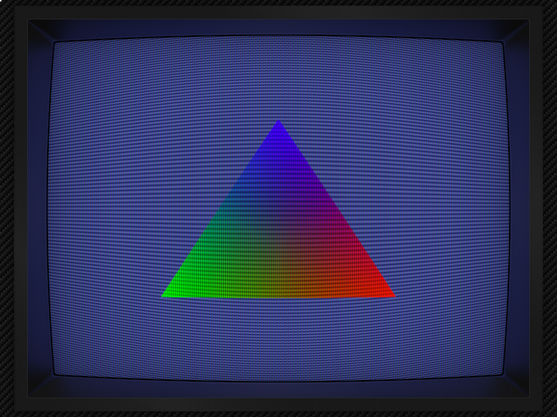

# librashader



<small>*Mega Bezel SMOOTH-ADV on DirectX 11*</small>

librashader (*/ˈli:brəʃeɪdɚ/*) is a preprocessor, compiler, and runtime for RetroArch 'slang' shaders, rewritten in pure Rust.

[](https://crates.io/crates/librashader) [](https://docs.rs/librashader) [](https://software.opensuse.org//download.html?project=home%3Achyyran%3Alibrashader&package=librashader)

 

## Installation
For end-users, librashader is available from the [Open Build Service](https://software.opensuse.org//download.html?project=home%3Achyyran%3Alibrashader&package=librashader) for a variety of Linux distributions and platforms. Windows users can grab the latest DLL from [GitHub Releases](https://github.com/SnowflakePowered/librashader/releases).

## Supported Render APIs
librashader supports OpenGL 3, OpenGL 4.6, Vulkan, Direct3D 11, and Direct3D 12.  Metal and WebGPU
are not currently supported (but pull-requests are welcome). librashader does not support legacy render
APIs such as older versions of OpenGL, or legacy versions of Direct3D.

| **API**     | **Status** | **`librashader` feature** |
|-------------|------------|---------------------------|
| OpenGL 3.3+ | ✔          | `gl`                      |
| OpenGL 4.6  | ✔          | `gl`                      |
| Vulkan      | ✔          | `vk`                      |
| Direct3D 11 | ✔          | `d3d11`                   |
| Direct3D 12 | ✔          | `d3d12`                   |
| wgpu        | ✔          | `wgpu`                    |
| Metal       | ❌         |                           |

✔ = Render API is supported &mdash; ❌ Render API is not supported

## Usage

librashader provides both a Rust API under the `librashader` crate, and a C API. Both APIs are first-class and fully supported.
The C API is geared more towards integration with existing projects. The Rust `librashader` crate exposes more
of the internals if you wish to use parts of librashader piecemeal.

The librashader C API is best used by including `librashader_ld.h` in your project, which implements a loader that dynamically
loads the librashader (`librashader.so` or `librashader.dll`) implementation in the search path. 


### C compatibility
The recommended way of integrating `librashader` is by the `librashader_ld` single header library which implements
a dynamic loader for `librashader.dll` / `librashader.so`. See the [versioning policy](https://github.com/SnowflakePowered/librashader#versioning)
for details on how librashader handles C ABI and API stability with regards to library updates.

Linking statically against `librashader.h` is possible, but is not officially supported. You will need to ensure
linkage parameters are correct in order to successfully link with `librashader.lib` or `librashader.a`.
The [corrosion](https://github.com/corrosion-rs/) CMake package is highly recommended.

### Thread safety
In general, it is **safe** to create a filter chain instance from a different thread, but drawing frames requires
**external synchronization** of the filter chain object.

Filter chains can be created from any thread, but requires external synchronization of the graphics device queue where applicable
(in Direct3D 11, the immediate context is considered the graphics device queue), as loading LUTs requires command submission to the GPU.
Initialization of GPU resources may be deferred asynchronously using the `filter_chain_create_deferred` functions, but the caller is responsible for
submitting the recorded commands to the graphics device queue, and **ensuring that the work is complete** before drawing shader pass frames.

OpenGL has an additional restriction where creating the filter chain instance in a different thread is safe **if and only if**
the thread local OpenGL context is initialized to the same context as the drawing thread. Support for deferral of GPU resource initialization
is not available to OpenGL.

### Quad vertices and rotations
All runtimes except OpenGL render with an identity matrix MVP and a VBO for with range `[-1, 1]`. The final pass uses a
Quad VBO with range `[0, 1]` and the following projection matrix by default.

```rust
static DEFAULT_MVP: &[f32; 16] = &[
  2.0, 0.0, 0.0, 0.0,
  0.0, 2.0, 0.0, 0.0,
  0.0, 0.0, 0.0, 0.0,
  -1.0, -1.0, 0.0, 1.0,
];
```

As with RetroArch, a rotation on this MVP will be applied only on the final pass for these runtimes. This is the only way to
pass orientation information to shaders.

The OpenGL runtime uses a VBO for range `[0, 1]` for all passes and the following MVP for all passes.

```rust 
static GL_DEFAULT_MVP: &[f32; 16] = &[
    2.0, 0.0, 0.0, 0.0,
    0.0, 2.0, 0.0, 0.0,
    0.0, 0.0, 2.0, 0.0,
    -1.0, -1.0, 0.0, 1.0,
];
```

### Building

For Rust projects, simply add the crate to your `Cargo.toml`. 

```
cargo add librashader
```

To build the C compatible dynamic library, run the build script.

```
cargo run -p librashader-build-script -- --profile optimized
```

This will output a `librashader.dll` or `librashader.so` in the target folder. Profile can be `debug`, `release`, or 
`optimized` for full LTO.

While librashader has no build-time dependencies, using `librashader_ld.h` may require headers from
the relevant runtime graphics API.

### Writing a librashader Runtime

If you wish to contribute a runtime implementation not already available, see the [librashader-runtime](https://docs.rs/librashader-runtime/latest/librashader_runtime/)
crate for helpers and shared logic used across all librashader runtime implementations. Using these helpers and traits will
ensure that your runtime has consistent behaviour for uniform and texture semantics bindings with the existing librashader runtimes.

These types should not be exposed to the end user in the runtime's public API, and should be kept internal to the implementation of
the runtime.

## Examples

The following Rust examples show how to use each librashader runtime.
* [Vulkan](https://github.com/SnowflakePowered/librashader/blob/master/librashader-runtime-vk/tests/triangle.rs)
* [OpenGL](https://github.com/SnowflakePowered/librashader/blob/master/librashader-runtime-gl/tests/triangle.rs)
* [Direct3D 11](https://github.com/SnowflakePowered/librashader/blob/master/librashader-runtime-d3d11/tests/triangle.rs)
* [Direct3D 12](https://github.com/SnowflakePowered/librashader/blob/master/librashader-runtime-d3d12/tests/triangle.rs)

Some basic examples on using the C API are also provided in the [librashader-capi-tests](https://github.com/SnowflakePowered/librashader/tree/master/test/capi-tests/librashader-capi-tests)
directory.

## Compatibility

librashader implements the entire RetroArch shader pipeline and is highly compatible with existing shaders.

Please report an issue if you run into a shader that works in RetroArch, but not under librashader.

* Filter chains do not terminate at the backbuffer.
  * Unlike RetroArch, librashader does not have full knowledge of the entire rendering state and is designed to be pluggable
    at any point in your render pipeline. Instead, filter chains terminate at a caller-provided output surface and viewport. 
    It is the caller's responsibility to blit the surface back to the backbuffer.
* Shaders are compiled in parallel where possible. This should noticeably decrease preset compile times. 
  Parallel shader compilation is not available to OpenGL. 
* HDR10 support is not part of any shader runtime and is not supported by librashader.
* For performance reasons, mipmaps are never generated for the input texture. In theory, this means that 
  presets with `mipmap_input0 = "true"` will not get a mipmapped input. In practice, no known shader presets set 
  `mipmap_input0 = "true"`.
* The preset parser is a substantially stricter implementation that the one in RetroArch. Not all shader presets may be
  compatible. If you find this is the case, please file an issue so a workaround can be added.
### Runtime specific differences
* OpenGL
  * Copying of in-flight framebuffer contents to history is done via `glBlitFramebuffer` rather than drawing a quad into an intermediate FBO.
  * Sampler objects are used rather than `glTexParameter`.
  * Sampler inputs and outputs are not renamed. This is useful for debugging shaders in RenderDoc.
  * UBO and Push Constant Buffer sizes are padded to 16-byte boundaries.
* OpenGL 4.6+
  * All caveats from the OpenGL 3.3+ section should be considered.
  * Should work on OpenGL 4.5 but this is not guaranteed. The OpenGL 4.6 runtime may eventually switch to using `ARB_spirv_extensions` for loading shaders, and this will not be marked as a breaking change.
  * The OpenGL 4.6 runtime uses Direct State Access to minimize changes to the OpenGL state. For GPUs released within the last 5 years, this may improve performance.
* Vulkan
  * The Vulkan runtime uses [`VK_KHR_dynamic_rendering`](https://registry.khronos.org/vulkan/specs/1.3-extensions/man/html/VK_KHR_dynamic_rendering.html) by default.
    This extension must be enabled at device creation. Explicit render passes can be used by configuring filter chain options, but may have reduced performance 
    compared to dynamic rendering.
  * Allocations within the runtime are done through [gpu-allocator](https://github.com/Traverse-Research/gpu-allocator) rather than handled manually.
* Direct3D 11
  * Framebuffer copies are done via `ID3D11DeviceContext::CopySubresourceRegion` rather than a CPU conversion + copy.
* Direct3D 12
  * The Direct3D 12 runtime uses [render passes](https://learn.microsoft.com/en-us/windows/win32/direct3d12/direct3d-12-render-passes). This feature has been available since Windows 10 version 1809,
    which was released in late 2018.
  * For maximum compatibility with shaders, a shader compile pipeline based on [`spirv-to-dxil`](https://github.com/SnowflakePowered/spirv-to-dxil-rs) is used, with the SPIRV-Cross HLSL pipeline used as a fallback. 
    This brings shader compatibility beyond what the RetroArch Direct3D 12 driver provides. The HLSL pipeline fallback may be removed in the future as `spirv-to-dxil` improves.
  * The Direct3D 12 runtime requires `dxil.dll` and `dxcompiler.dll` from the [DirectX Shader Compiler](https://github.com/microsoft/DirectXShaderCompiler).

Most, if not all shader presets should work fine on librashader. The runtime specific differences should not affect the output,
and are more a heads-up for integrating librashader into your project.

## Versioning
[](https://crates.io/crates/librashader)


librashader typically follows [Semantic Versioning](https://semver.org/) with respect to the Rust API, where a minor version
number bump indicates a 'breaking change' during `0.x.y`, and a non-'breaking change' after `1.x.y`. However, a
"breaking change" that results in a version number bump does not correspond to a break in the C API after version 0.1.0. 

The C API is instead versioned separately with two monotonically increasing version numbers exported to the librashader
C headers

- [`LIBRASHADER_CURRENT_VERSION`](https://github.com/SnowflakePowered/librashader/blob/f8de1fa2ee75270e5655284edf39ea070d6ec6f5/librashader-capi/src/version.rs#L16) specifies the *API* version exported by the librashader implementation.
- [`LIBRASHADER_CURRENT_ABI`](https://github.com/SnowflakePowered/librashader/blob/f8de1fa2ee75270e5655284edf39ea070d6ec6f5/librashader-capi/src/version.rs#L29) specifies the *ABI* version exported by the librashader implementation.

An increase in `LIBRASHADER_CURRENT_VERSION` is guaranteed to be **backwards compatible for the same `LIBRASHADER_CURRENT_ABI`**.
It somewhat corresponds to a "minor" version in semantic versioning terminology, except that it is always monotonically increasing.
Backwards-compatible additions to the C API will result in an increase to `LIBRASHADER_CURRENT_VERSION`.

APIs introduced after a certain `LIBRASHADER_CURRENT_VERSION` **may or may not** be available to prior versions. In particular, new features enabled by 
filter or frame option structs **require `LIBRASHADER_CURRENT_VERSION` be the greater than or equal** to the version in which the option was
introduced, or a default value will be passed, which may or may not enable the feature depending on backwards compatibility for
that particular feature. 

Any change to `LIBRASHADER_CURRENT_ABI` indicates a **breaking change** for the C **ABI**. For safety reasons, `librashader_ld.h`
will check to ensure that `LIBRASHADER_CURRENT_ABI` matches that of the loaded librashader binary. If it does not match, 
librashader will not load. A value of `0` for `LIBRASHADER_CURRENT_ABI` indicates the "null" instance where every operation
is a no-op, which occurs if no compatible librashader implementation could be found.

The `SONAME` of `librashader.so` when installed via package manager is set to `LIBRASHADER_CURRENT_ABI`.

The above does not apply to releases of librashader prior to `0.1.0`, which were allowed to break API and ABI compatibility
in both the Rust and C API without an increase to either `LIBRASHADER_CURRENT_VERSION` or `LIBRASHADER_CURRENT_ABI`.

## License
The core parts of librashader such as the preprocessor, the preset parser, 
the reflection library, and the runtimes, are all licensed under the Mozilla Public License version 2.0.

The librashader C API, i.e. its headers and definitions, *not its implementation in `librashader-capi`*,
are more permissively licensed, and may allow you to use librashader in your permissively 
licensed or proprietary project.

To facilitate easier use of librashader in projects incompatible with MPL-2.0, `librashader_ld`
implements a loader which thunks its calls to any `librashader.so` or `librashader.dll`
library found in the load path. A non-MPL-2.0 compatible project may link against
`librashader_ld` to use the librashader runtime, *provided that `librashader.so` or `librashader.dll` 
are distributed under the restrictions of MPLv2*.

Note that this means that if your project is unable to comply with the requirements of MPL-2.0, 
you **can not distribute `librashader.so` or `librashader.dll`** alongside your project. 
The end user must obtain the implementation of librashader themselves. For more information, 
see the [MPL 2.0 FAQ](https://www.mozilla.org/en-US/MPL/2.0/FAQ/).


At your discretion, you may instead choose to distribute `librashader` under the terms of GPLv3 rather than MPL-2.0.